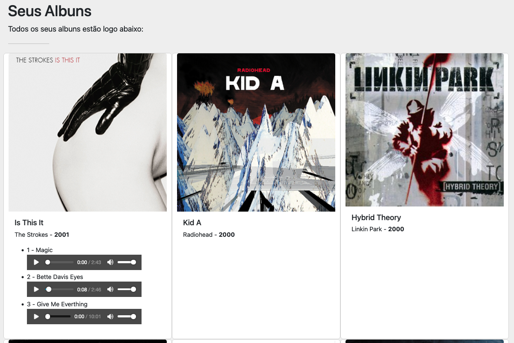

# 3o Ano - Prova Trimestral

> Vocês podem usar esse projeto como base para o desenvolvimento da prova ou
utilizar o projeto que vocês desenvolveram durante as aulas.

# Atividades

## 1) Armazenar a lista de músicas no LocalStorage

Quando abrirem o site, o site deve ter uma lista de albuns pré populada.
Caso seja adicionado um novo album, os albuns devem ser armazenados no
[LocalStorage][1].
Caso seja adicionado um novo album e recarregue a página, o novo album deve estar
na listagem de albuns.

> Lembre-se, o LocalStorage armazena apenas Strings, então para converter
> objetos do JavaScript para string use o [`JSON.stringify(objeto)`][3] e para
> converter a string em um objeto use o [`JSON.parse(string)`][4].

## 2) Sincronizar a lista entre abas

Quando abrirem o site em duas janelas, ao adicionar um novo album em uma janela
ele deve aparecer na outra.
Para isso a atividade **1) Armazenar a lista de músicas no LocalStorage**
precisa ter sido concluída.
Você deve usar o evento [`"storage"`][2] para fazer a sincronização das duas
listas de albuns.

## 3) Mostrar uma lista de músicas para um album


Ao clicar no album, deve ser mostrada uma lista de músicas referentes aquele
album. Essas músicas devem ser buscadas na [API][6].

A lista de músicas pode ser apresentada diretamente no card, como no exemplo
abaixo, ou usando um modal, isso fica a critério do aluno.




Para pegar os dados da API, utilize o [`fetch`][7]. A maneira mais prática de
utilizá-lo é da seguinte forma:

```js

async function pegarDadosDaAPI(nomeDoAlbum) {
  //const nomeDoAlbum = "Is This It"
  const respostaDaApi = await fetch(`https://api.gvillalta.com/albums/${encodeURIComponent(nomeDoAlbum)}`).then(response => response.json())
  return respostaDaApi
}

const listaDeMusicas = pegarDadosDaAPI("Is This It")
```

Os dados da API sempre seguirão o seguinte formato:

```json
[
  {
    "id": "18fd91f2-8524-4025-8644-a915b21480cd",
    "numero_da_faixa": 1,
    "nome": "Magic",
    "tempo": "6:15",
    "media_url": "https://media.gvillalta.com/d37e99457745f0cc7a61828e2b71de14"
  },
  {
    "id": "0aeea8de-133d-4388-bcf5-fdfb8ddbeb64",
    "numero_da_faixa": 2,
    "nome": "Bette Davis Eyes",
    "tempo": "5:45",
    "media_url": "https://media.gvillalta.com/a9ab41ec7979a9be6a8c5514a6d2e383"
  },
  {
    "id": "9963aca8-0f60-4bd0-bfcc-2067030e7ef7",
    "numero_da_faixa": 3,
    "nome": "Give Me Everything",
    "tempo": "9:07",
    "media_url": "https://media.gvillalta.com/6ce2f19b86521cb94006bf10edfd8423"
  }
]
```


## 4) Tocar uma música

Usar o elemento `<audio>` para tocar as músicas retornadas pela API no atributo
`media_url`, essa músicas estão todas em formato `audio/ogg`.

```html
<div class="card-body">
      <h5 class="card-title">Is This It</h5>
      <p class="card-text">The Strokes - <b>2001</b></p>
      <ul class="musicas">
        <li>1 - Magic <audio controls src="https://media.gvillalta.com/d37e99457745f0cc7a61828e2b71de14" type="audio/ogg"></audio></li>
      </ul>
</div>
```


[1]:https://developer.mozilla.org/en-US/docs/Web/API/Window/localStorage
[2]:https://developer.mozilla.org/en-US/docs/Web/API/Window/storage_event
[3]:https://developer.mozilla.org/en-US/docs/Web/JavaScript/Reference/Global_Objects/JSON/stringify
[4]:https://developer.mozilla.org/en-US/docs/Web/JavaScript/Reference/Global_Objects/JSON/parse
[5]:https://developer.mozilla.org/en-US/docs/Web/HTML/Element/audio
[6]:https://api.gvillalta.com/
[7]:https://developer.mozilla.org/pt-BR/docs/Web/API/Fetch_API/Using_Fetch
